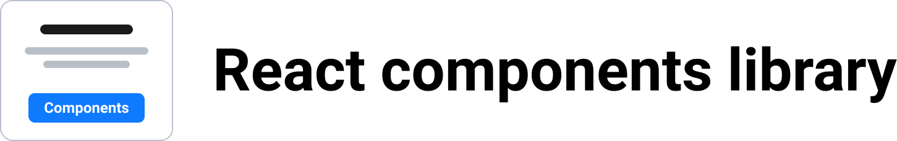

  

  
  

## Demo
https://cergmin.github.io/components

## Commands
`npm i` — install dependencies 
`npm run build` — build library 
`npm run build-examples` — build examples 
`npm run build-all` — build library and examples 
`npm run watch` — run library building in watch mode 
`npm run test` — run unit tests with jest 
`npm run fix` — fix code with prettier, eslint and stylelint 

## Components
- SimpleButton
